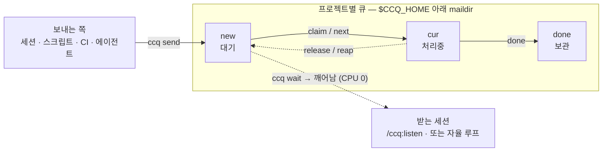

# ccq

[](https://github.com/rekyungmin/ccq/actions/workflows/ci.yml)
&nbsp;[](LICENSE)

> 다른 프로젝트의 인박스에 작업을 남겨두면, 그곳의 에이전트 세션이 알아서 집어 갑니다.

[English](README.md) | **한국어**

`ccq`는 AI 코딩 에이전트 세션(Claude Code, Codex 등)에 작업을 넘겨주기 위한 작고 빠른
메시지 큐입니다. **프로젝트를 가로질러, 에이전트를 가로질러, 누구도 방해하지 않고** 일을 전달합니다.
필요한 맥락이 다 담긴 지시문 하나를 프로젝트 큐에 넣어두면, 거기서 돌고 있는 세션이(지금이든, 나중에 열리든)
그것을 검토하고 실행한 뒤 완료 처리합니다.

단일 macOS 바이너리 하나로 동작합니다. 데몬도, 서버도, 런타임 의존성도 없습니다 —
디스크 위의 파일과 커널의 원자적 rename이 전부입니다.

---

## 왜 ccq인가요?

한 프로젝트에 깊이 빠져 있다가 다른 프로젝트를 손봐야 한다는 걸 깨달았을 때, 선택지가 마땅치 않습니다.
살아 있는 세션 위에 두 번째 세션을 띄우면(`claude -p --resume`) 트랜스크립트가 갈라지고 메시지가
유실됩니다. 공유 "채널" 기능은 조직 정책으로 막혀 있는 경우가 많습니다. 게다가 보통은 한창 생각 중인
세션에 **끼어들고 싶지 않습니다**.

솔깃한 지름길도 있습니다 — 지금 세션에 *다른* 프로젝트의 경로를 주고 거기서 편집시키는 거죠. 구현은
되지만, 그 세션은 여전히 **내** 프로젝트에 뿌리내린 상태라 **대상 프로젝트의 Claude Code 설정 없이**
동작합니다: 그쪽 hooks는 아예 실행되지 않고, `CLAUDE.md`·프로젝트 스킬·권한도 로드되지 않습니다.
Claude Code는 이것들을 세션의 작업 디렉터리 기준으로 로드하지, 건드리는 파일 경로 기준으로 로드하지
않으니까요 — 그래서 작업이 그 프로젝트의 가드레일·자동화 밖에서 이뤄집니다. (특히 hooks는 그 프로젝트
*안에서* 실제로 도는 세션에서만 작동합니다.)

ccq는 그 사이의, 지루하지만 믿을 수 있는 해법입니다 — **프로젝트별 인박스**입니다. 누구든(다른 세션,
스크립트, CI, 심지어 다른 종류의 에이전트까지) 작업을 넣을 수 있고, 받는 세션은 자기 페이스대로 — **그
프로젝트 안에서**, hooks·스킬·`CLAUDE.md`·권한이 모두 적용된 채로 — 꺼내 처리합니다. 아무것도 끼어들지
않고, 충돌이나 크래시로 잃어버리지도 않습니다.

## 한눈에 보기

```console
# ~/code/web 에서 작업하다, api 쪽에 마이그레이션이 필요해졌습니다:
$ ccq send -d ~/code/api "대기 중인 DB 마이그레이션을 실행하고 스키마 diff를 보고해 줘."
queued → /Users/you/code/api (1 pending)
```

```console
# 한편, ~/code/api 에 떠 있는 세션:
$ ccq wait            # 메시지가 도착할 때까지 CPU 0으로 블록 — 도착하면 종료됩니다
$ /ccq:listen         # 큐 검토 → 실행할 것 선택 → 실행 → 완료 처리
```

핵심은 이게 전부입니다. 보내는 쪽이 쪽지를 남기고, 받는 쪽이 집어 갑니다:



claim은 원자적이고(소비자 한 명만 이깁니다), 소비자가 죽으면 그 claim은 자동으로 `new`로
돌아옵니다 — 그래서 중복 실행도, 유실도 없습니다.

## 언제 쓰면 좋나요

- **프로젝트 간 핸드오프** — `web`에 머문 채로 "이건 `api` 세션이 하게" 넘길 때.
- **나중을 위한 적재** — 지금 넣어두면, 그 프로젝트에서 세션이 다음에 열릴 때 기다리고 있습니다.
- **에이전트 간 핸드오프** — Codex 세션이 같은 프로젝트의 Claude 세션에 작업을 남길 수 있습니다
  (큐와 CLI는 완전히 에이전트 중립입니다).
- **자율 루프** — 백그라운드 세션이 `ccq wait`로 블록해 있다가 도착할 때마다 처리하고 다시 잠듭니다.
  폴링도, 토큰 낭비도 없습니다.
- **스크립트 · CI** — 아무 셸에서나 프로젝트 큐에 후속 작업을 떨궈 둘 수 있습니다.

**이럴 땐 안 맞습니다:** ccq는 던져놓고 잊는(fire-and-forget) 로컬 IPC이지, 요청/응답 RPC도,
머신 간 브로커도, 고처리량 메시지 버스도 아닙니다. 그런 용도라면 제대로 된 큐를 쓰세요.

## 기능

- 📨 **프로젝트 루트 기준 인박스** — 저장소의 어떤 하위 경로로 보내든 같은 큐에 들어갑니다.
  모노레포의 하위 패키지는 원할 때 따로 격리할 수 있습니다.
- ⚡ **즉시·CPU 0의 `wait`** — kqueue 이벤트 기반이라, 도착하면 수 밀리초 안에 세션이 깨어나고,
  대기 중에는 아무것도 소모하지 않습니다.
- 🤝 **에이전트 중립** — 어떤 에이전트나 일반 셸에서도 보내고 받을 수 있습니다. 저장소도 특정
  에이전트의 홈이 아니라 중립적인 위치에 둡니다.
- 🔒 **설계로 보장되는 안전성** — 원자적·덮어쓰기 없는 파일 이동으로 경합 시 정확히 한 소비자만
  이깁니다. 죽은 세션의 클레임은 자동으로 큐로 회수됩니다.
- 🪶 **의존성 0** — 약 1.3 MB 유니버설 macOS 바이너리 하나. `jq`도, 데몬도, 락도 필요 없습니다.
- 🌏 **이중 언어 출력** — 기본 영어, `--lang ko`로 한국어. 기계용(`--json`) 출력은 언어와 무관하게 동일합니다.

## 설치

ccq는 Claude Code 플러그인으로 배포되며, 두 계층으로 나뉩니다.

**1. Claude Code 세션 안 — 설치 0.**

```text
/plugin marketplace add rekyungmin/ccq
/plugin install ccq@ccq
```

플러그인이 켜져 있는 동안 `ccq`는 세션의 `PATH`에 자동으로 올라가므로, `send`와 `/ccq:listen`
스킬이 곧바로 동작합니다.

**2. 독립 실행 CLI — statusline · 터미널 · cron, 또는 Claude 외 사용.** 바이너리를 `PATH`에 올립니다:

```sh
# 원라이너 — 최신 릴리스를 ~/.local/bin 에 받습니다:
curl -fsSL https://raw.githubusercontent.com/rekyungmin/ccq/main/install.sh | sh

# 또는, Claude Code 세션 안에서 (ccq가 이미 PATH에 있을 때):
ccq install

# 또는, 클론한 저장소에서:
sh install.sh
```

> `send`/`listen` *스킬*은 Claude 전용이지만, CLI 자체는 어떤 에이전트에서도 동작합니다.
> 직접 빌드하려면 `cargo build --release`.

설치 상태는 언제든 `ccq doctor`로 확인할 수 있습니다.

## 사용법

### 작업 보내기

```sh
ccq send -d ~/code/api "auth 모듈 테스트 추가"            # 다른 프로젝트로
ccq send "배포 끝남 — 스모크 테스트 돌려줘"               # 현재 프로젝트로
ccq send --from ci-bot "nightly 빌드 통과"               # 발신자 라벨 지정
printf '여러 줄로 된\n긴 지시문' | ccq send -d ~/code/api -   # stdin으로
```

각 메시지는 **그 자체로 완결된 하나의 지시문**으로 작성하세요 — 받는 세션은 지금 이 대화의 맥락을 전혀
모르므로, 필요한 배경을 메시지 안에 담고 절대 경로를 사용하면 됩니다.

### 작업 받기

**대화형**으로, 받는 세션 안에서 — 지금 검토하고 실행할 것을 고릅니다:

```text
/ccq:listen                       # 큐 검토 → 선택 → 실행 → 정리
/ccq:listen peek | log | history  # 실행 없이 들여다보기
```

**백그라운드**로, 계속 작업해야 하는 세션이라면 — `watch` 스킬이 비용 0의 `ccq wait`를 걸어두고,
메시지가 도착하는 순간 세션을 깨워 검토하거나 처리합니다.

**독립 워커**로 (터미널이나 Claude 외 에이전트):

```sh
while ccq wait --json; do     # 메시지가 올 때까지 블록 (CPU 0)
  ccq next --json             # 가장 오래된 것을 원자적으로 집어 작업하고…
  ccq done <id>               # …끝나면 보관 처리
done
```

내부적으로 처리는 작은 라이프사이클을 따릅니다 — `claim`은 다른 곳에서 중복 실행하지 못하도록
메시지를 선점하고, `done`은 보관하며, `release`는 다시 큐로 돌려놓습니다.
자세한 내용은 [docs/cli.md](docs/cli.md)를 참고하세요.

## 프로젝트 단위 큐

큐는 **프로젝트 루트**에 속하므로, 트리에서 얼마나 깊이 들어가 있든 상관없습니다:

```sh
cd ~/code/cortex/services/api/src
ccq status        # → root: ~/code/cortex   (via git)
```

ccq는 위로 거슬러 올라가며 루트를 찾습니다 — 명시적 `--root`가 최우선이고, 그다음 가장 가까운
`.ccq/` 마커, 그다음 **git 워크트리라면 메인 레포의 워킹트리**, 그다음 감싸는 `.git`,
마지막으로 그 디렉토리 자신입니다. 패키지마다 자기 큐를 가져야 하는 **모노레포**라면, 한 번씩 표시해 두면 됩니다:

```sh
ccq init   # services/serviceA, serviceB … 안에서 실행 → 커밋되는 .ccq/ 마커 생성
```

이제 `services/serviceA/**`는 모노레포 루트가 아니라 `serviceA`의 큐로 해석됩니다.

**git 워크트리**는 기본적으로 *메인* 레포의 큐로 해석됩니다 — "프로젝트로 보내면" 어느 체크아웃에 있든
그 세션이 받습니다. 워크트리 자기 큐를 쓰려면 `--worktree`(또는 `CCQ_WORKTREE`), 의도적인 레인 분리는
`--key`를 쓰세요.

`ccq status` / `ccq root`는 어느 큐에 닿을지, 그리고 그 이유를 항상 알려줍니다.

## 동작 원리

각 큐는 `$CCQ_HOME`(기본값 `~/.local/state/ccq`) 아래의
[maildir](https://en.wikipedia.org/wiki/Maildir) 스타일 디렉토리입니다 — 메시지는 `tmp/`에 쓰인 뒤
`new/`로 원자적으로 publish되고, 선점되면 `cur/`로, 완료되면 `done/`으로 옮겨집니다. 동시성은 전적으로
원자적·덮어쓰기 없는 rename에 기댑니다 — 데몬도 락도 없습니다. 클레임은 소유자의 pid와 프로세스
시작 시각을 기록하므로, 세션이 죽으면 그 클레임은 자동으로 큐에 회수되고, 정당하게 오래 도는 작업은
결코 빼앗기지 않습니다.

주소 체계, JSON 계약, 종료 코드, 동시성 모델까지 전체 설계는 [docs/spec.md](docs/spec.md)에 있습니다.

## 문서

- **[docs/cli.md](docs/cli.md)** — 모든 명령, 옵션, 종료 코드, 저장 레이아웃.
- **[docs/spec.md](docs/spec.md)** — 설계 스펙 / 온디스크 계약.
- **[CHANGELOG.md](CHANGELOG.md)** — 릴리스 노트.

## 언어

기본은 영어입니다. 한국어는 `--lang ko` 또는 `CCQ_LANG=ko`로 켭니다
(우선순위: `--lang` > `CCQ_LANG` > 기본값, 로케일 자동 감지는 하지 않습니다). `--json` 출력은
언어와 무관하게 바이트 단위로 동일합니다.

## 제약

- 들어오는 메시지가 살아있는 세션에 끼어드는 일은 없습니다 — 세션이 자기 페이스로 가져갑니다:
  지금 검토는 `/ccq:listen`, 도착 시 깨어나려면 `watch` 스킬, 또는 statusline의 📬.
- 저장소에 쓸 수 있는 사람은 세션을 조종할 수 있습니다 — 신뢰할 수 있는 로컬 사용자를 전제합니다.
- **macOS 전용**입니다(`proc_pidinfo`, kqueue, `renameatx_np`를 사용). 다른 플랫폼도 가능하지만
  목표는 아닙니다.

## 개발

```sh
cargo test                              # 유닛 + 통합 (assert_cmd)
cargo clippy --all-targets -- -D warnings
cargo build --release                   # 아치별 빌드; CI가 lipo로 유니버설 bin/ccq 생성
```

ccq는 Rust(edition 2024)로 작성되었으며, `bin/ccq`는 커밋된 유니버설(arm64 + x86_64) 바이너리라
플러그인이 별도 빌드 단계 없이 바로 동작합니다.

## 라이선스

[MIT](LICENSE) © Kyungmin Lee
