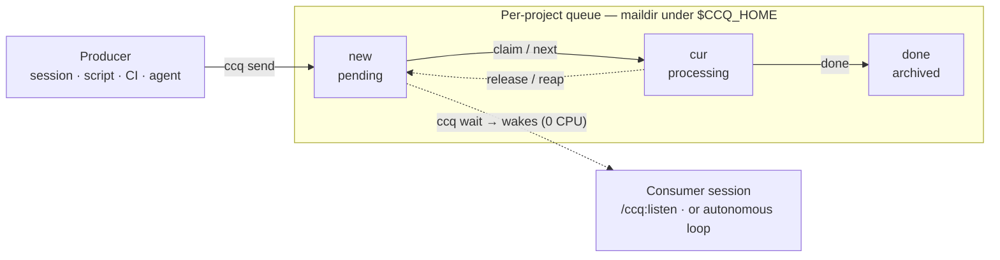

# ccq

> Leave a task in another project's inbox — its agent session picks it up.

**English** | [한국어](README.ko.md)

`ccq` is a tiny, fast message queue for handing work to AI coding-agent sessions
(Claude Code, Codex, …) — **across projects, across agents, without interrupting anyone**.
You drop a self-contained instruction into a project's queue; the session running there
(now, or whenever one opens) reviews it, runs it, and marks it done.

It's one self-contained macOS binary. No daemon, no server, no runtime dependencies — just
files on disk and the kernel's atomic rename.

---

## Why ccq?

When you're deep in one project and realize another one needs a change, your options are
awkward. Resuming a second session over a live one (`claude -p --resume`) branches the
transcript and loses messages. Shared "channels" are often blocked by org policy. And you
usually *don't* want to barge into a session that's mid-thought.

There's also the tempting shortcut — just hand your current session the *other* project's path
and let it edit there. That implements the change, but the session is still rooted in **your**
project, so it runs **without the target project's Claude Code setup**: its hooks never fire,
and its `CLAUDE.md`, project skills, and permissions aren't loaded. Claude Code resolves those
from the session's working directory, not from whatever paths it happens to touch — so the work
lands outside that project's guardrails and automation. (Hooks especially: they only run for a
session actually executing *in* that project.)

ccq is the boring, reliable middle ground: a **per-project inbox**. Anyone — another session,
a script, CI, a different agent entirely — can enqueue work. The receiving session pulls it on
its own terms — **in that project**, with its hooks, skills, `CLAUDE.md`, and permissions all in
effect. Nothing interrupts anything; nothing gets lost to a crash or a race.

## A quick look

```console
# You're working in ~/code/web and the API needs a migration:
$ ccq send -d ~/code/api "Run the pending DB migration, then report the schema diff."
queued → /Users/you/code/api (1 pending)
```

```console
# Meanwhile, the session living in ~/code/api:
$ ccq wait            # blocks with zero CPU until a message arrives — then exits
$ /ccq:listen         # review the queue, pick what to run, execute, mark done
```

That's the whole idea. A producer leaves a note; a consumer picks it up:



A claim is atomic (exactly one consumer wins), and if a consumer dies its claim is
automatically returned to `new` — so nothing is double-run and nothing is lost.

## When to use it

- **Hand off across projects** — "have the `api` session run this" while you stay in `web`.
- **Queue work for later** — enqueue now; it's waiting when a session next opens that project.
- **Cross-agent handoff** — a Codex session can leave work for a Claude session in the same
  project (the queue and CLI are completely agent-neutral).
- **Autonomous loops** — a background session blocks on `ccq wait`, processes each arrival,
  and goes back to sleep. No polling, no wasted tokens.
- **Scripts & CI** — drop follow-up tasks into a project's queue from any shell.

**When *not* to:** ccq is fire-and-forget local IPC, not a request/response RPC, not a
cross-machine broker, and not a high-throughput message bus. For those, reach for a real queue.

## Features

- 📨 **Per-project inbox** keyed at the **project root** — a message sent to any subpath of a
  repo lands in the same queue; monorepo sub-packages can be isolated on purpose.
- ⚡ **Instant, zero-CPU `wait`** — event-driven via kqueue; the session wakes within
  milliseconds of an arrival and burns nothing while idle.
- 🤝 **Agent-agnostic** — any agent or plain shell can send and consume; the store lives in a
  neutral location, not under any one agent's home.
- 🔒 **Safe by construction** — atomic, no-clobber file moves mean exactly one consumer wins a
  contended message; dead sessions' claims are automatically recovered.
- 🪶 **Zero dependencies** — a single ~1.3 MB universal macOS binary. No `jq`, no daemon, no lock.
- 🌏 **Bilingual output** — English by default, Korean via `--lang ko`; machine (`--json`) output
  is identical in either.

## Install

ccq ships as a Claude Code plugin, in two layers.

**1. In a Claude Code session — zero install.**

```text
/plugin marketplace add rekyungmin/ccq
/plugin install ccq@ccq
```

While the plugin is enabled, `ccq` is on the session's `PATH` automatically — the `send` and
`/ccq:listen` skills just work.

**2. Standalone CLI — for the statusline, terminal, cron, or non-Claude use.** Put the binary
on your `PATH`:

```sh
# one-liner — downloads the latest release into ~/.local/bin:
curl -fsSL https://raw.githubusercontent.com/rekyungmin/ccq/main/install.sh | sh

# or, inside a Claude Code session (ccq is already on PATH):
ccq install

# or, from a clone:
sh install.sh
```

> The `send`/`listen` *skills* are Claude-specific, but the CLI itself works for any agent.
> Prefer to build it yourself? `cargo build --release`.

Check your setup any time with `ccq doctor`.

## Usage

### Send work

```sh
ccq send -d ~/code/api "add tests for the auth module"   # to another project
ccq send "deploy finished — run smoke tests"             # to the current project
ccq send --from ci-bot "nightly build is green"          # custom sender label
printf 'a long, multi-line\ninstruction' | ccq send -d ~/code/api -   # via stdin
```

Compose each message as a **single self-contained instruction** — the receiving session has
none of your current context, so include the background it needs and use absolute paths.

### Receive work

**Interactively**, in the receiving session — review now and pick what to run:

```text
/ccq:listen                       # review the queue → pick → run → tidy up
/ccq:listen peek | log | history  # look without running
```

**In the background**, in a session that should keep working — the `watch` skill arms a
zero-cost `ccq wait`, then wakes the session the moment a message lands to review or handle it.

**As a standalone worker** (a terminal or non-Claude agent):

```sh
while ccq wait --json; do     # block (0 CPU) until a message arrives
  ccq next --json             # atomically take the oldest, do the work…
  ccq done <id>               # …then archive it
done
```

Under the hood, processing is a small lifecycle — `claim` reserves a message so no one else
double-runs it, `done` archives it, `release` hands it back. See [docs/cli.md](docs/cli.md).

## Project-scoped queues

A queue belongs to a **project root**, so it doesn't matter how deep in the tree you are:

```sh
cd ~/code/cortex/services/api/src
ccq status        # → root: ~/code/cortex   (via git)
```

ccq finds the root by walking up: an explicit `--root` wins, then the nearest `.ccq/` marker,
then — for a **git worktree** — the main repo's working tree, then the enclosing `.git`, then the
directory itself. For a **monorepo** where each package deserves its own queue, mark them once:

```sh
ccq init   # run inside services/serviceA, serviceB, … → drops a committed .ccq/ marker
```

Now `services/serviceA/**` resolves to `serviceA`'s queue instead of the monorepo root.

A **git worktree** resolves to the *main* repo's queue by default, so "send to the project" reaches
the session whichever checkout it's in; pass `--worktree` (or set `CCQ_WORKTREE`) to keep a worktree's
own queue, and use `--key` for deliberate per-lane separation.

`ccq status` / `ccq root` always tell you which queue you'll hit, and why.

## How it works

Each queue is a [maildir](https://en.wikipedia.org/wiki/Maildir)-style directory under
`$CCQ_HOME` (default `~/.local/state/ccq`): a message is written to `tmp/`, atomically published
to `new/`, moved to `cur/` when claimed, and archived to `done/`. Concurrency rests entirely on
atomic, no-clobber renames — there is no daemon and no lock. A claim records its owner's pid and
process start-time, so if a session dies its claim is automatically returned to the queue, while
legitimate long-running work is never stolen.

The full design — addressing, the JSON contract, exit codes, the concurrency model — is in
[docs/spec.md](docs/spec.md).

## Documentation

- **[docs/cli.md](docs/cli.md)** — every command, option, exit code, and the storage layout.
- **[docs/spec.md](docs/spec.md)** — the design spec / on-disk contract.
- **[CHANGELOG.md](CHANGELOG.md)** — release notes.

## Language

English by default. Pass `--lang ko` or set `CCQ_LANG=ko` for Korean
(precedence: `--lang` > `CCQ_LANG` > default; no locale auto-detection). `--json` output is
byte-identical regardless of language.

## Limitations

- Incoming messages never barge into a live session — it picks them up on its own terms:
  `/ccq:listen` to review now, the `watch` skill to be woken on arrival, or the statusline 📬.
- Anyone who can write to the store can direct a session — assumes a trusted local user.
- **macOS only** (it uses `proc_pidinfo`, kqueue, and `renameatx_np`). Other platforms are
  possible but not a goal.

## Development

```sh
cargo test                              # unit + integration (assert_cmd)
cargo clippy --all-targets -- -D warnings
cargo build --release                   # per-arch; CI lipos a universal bin/ccq
```

ccq is written in Rust (edition 2024); `bin/ccq` is a committed universal (arm64 + x86_64)
binary so the plugin runs with no build step.

## License

[MIT](LICENSE) © Kyungmin Lee
